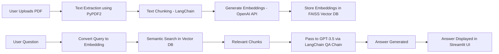

# 📄 SmartPDF QA Bot 🤖– AI Chatbot for Querying PDF Documents

An AI-powered chatbot that allows users to upload PDF documents and ask questions about their content. It leverages OpenAI's LLMs, semantic search with FAISS, and LangChain pipelines to provide intelligent, contextual answers.

---

## 🚀 Features

- 📤 Upload PDF documents
- 🧠 Extract and split document text into contextual chunks
- 🔍 Perform semantic search on document content
- 💬 Ask natural language questions about your document
- 🤖 Generate intelligent answers using GPT-3.5-turbo
- ⚡ Real-time web interface using Streamlit

---

## 🧱 Architecture Overview

---

## 🛠️ Tech Stack
Technology-----Purpose  
Python-----Programming language  
Streamlit-----Web app framework for UI  
PyPDF2-----PDF text extraction  
LangChain-----LLM chains and embeddings pipeline  
OpenAI API-----Embeddings + GPT-3.5-turbo (LLM)  
FAISS-----Vector store for fast semantic search  

---

## 📂 Project Structure

├── chatbot.py               # Main Streamlit app  
├── requirements.txt         # Python dependencies  
└── README.md                # Project documentation

---

## 🧪 How It Works

1.PDF Upload: The user uploads a PDF via the Streamlit sidebar.

2.Text Extraction: PyPDF2 extracts text from each page.

3.Chunking: Text is split into overlapping chunks using LangChain’s RecursiveCharacterTextSplitter.

4.Embedding: Each chunk is converted into vector embeddings using OpenAI’s API.

5.Vector Store: Embeddings are stored in FAISS for similarity search.

6.User Query: The user types a question related to the document.

7.Semantic Search: The query is embedded and matched with relevant document chunks.

8.Answer Generation: Using GPT-3.5 and LangChain’s QA chain, a contextual answer is generated.

9.Display: The answer is shown in the Streamlit UI.

---

## 🧰 Installation

#### 1. Clone the repository

git clone https://[github.com/your-username/SmartPDF-QA-Bot.git](https://github.com/Saiteja137/SmartPDF-QA-Bot/tree/main)  
cd SmartPDF-QA-Bot

#### 2. Create a virtual environment (optional but recommended)

python -m venv venv  
source venv/bin/activate  # For Windows: venv\Scripts\activate

#### 3. Install dependencies

pip install -r requirements.txt

#### 4. Add your OpenAI API key
   
Replace OPENAI_API_KEY in Bot.py with your actual API key.

#### ▶️ Run the App

streamlit run chatbot.py  
Then go to http://localhost:8501 in your browser to use the app.

---

## 📚 Use Cases

1.Legal document understanding

2.Academic research assistant

3.Financial report Q&A

4.Company policy exploration

5.Contract review assistant

